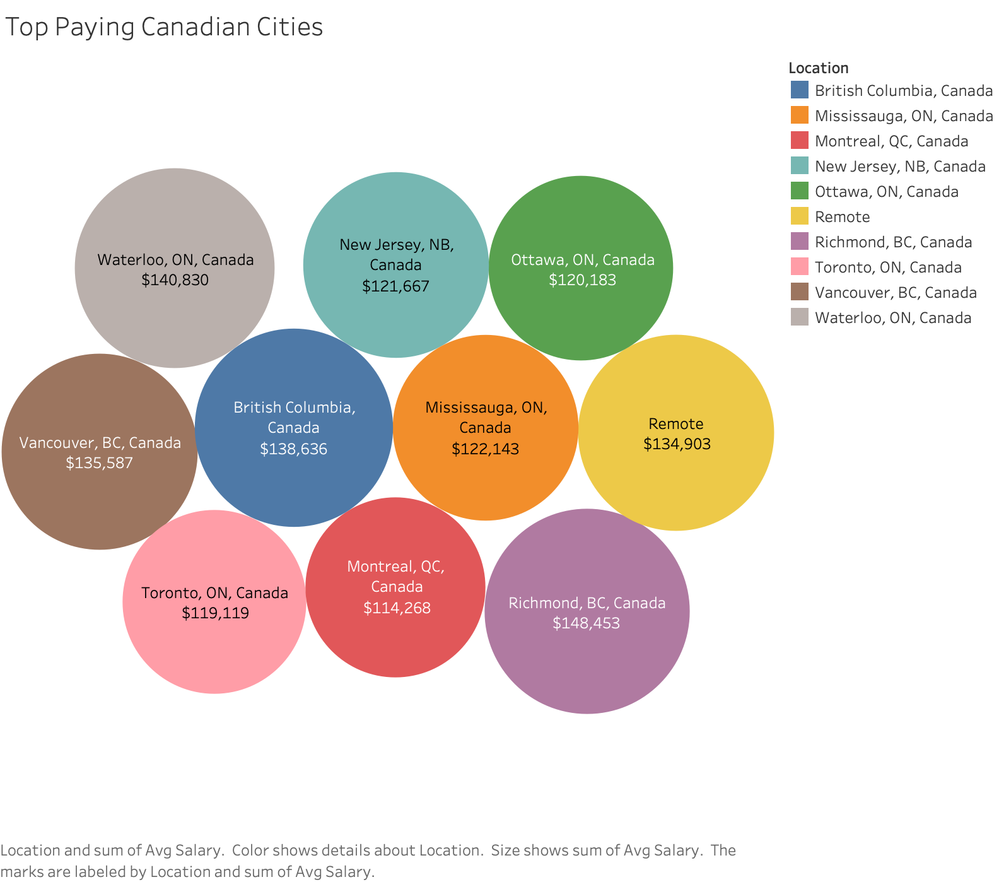
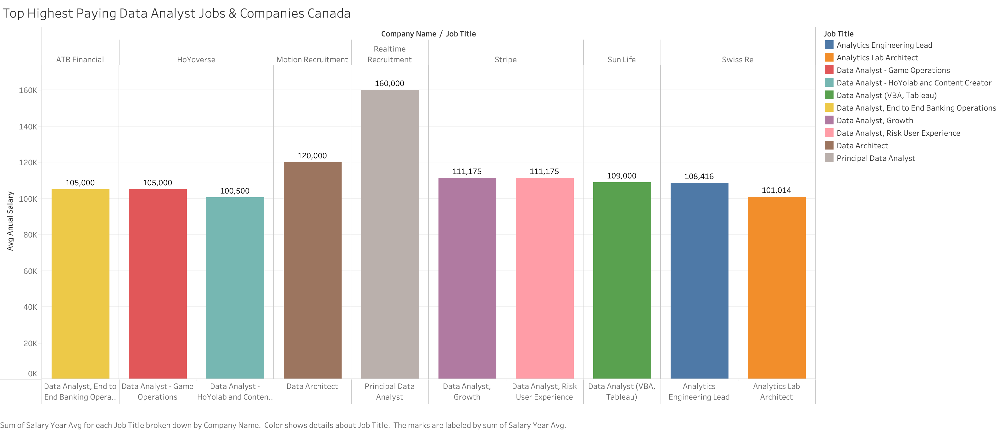

# 📊 Data Analyst Job Market Analysis

## 📌 Introduction

After years of wanting to dive deeper into **data analysis**, I finally took the plunge! I completed a **[Data Analytics course at BrainStation](https://brainstation.io/course/toronto/data-analytics?utm_keyword=brainstation%20data%20analytics&utm_network=g&utm_matchtype=e&utm_creative=482969347331&utm_target=&utm_placement=&utm_device=c&utm_campaign=11729367083&utm_adgroup=116579475769&utm_source=AdWords&utm_target_id=kwd-817758893710&gad_source=1&gclid=Cj0KCQiA_NC9BhCkARIsABSnSTa6vvUpxcpNFYK6xtl-IJxuRwRLpSxi7wY0g18OSwV2M4MCRjA7veQaAkyuEALw_wcB)**, an **[SQL Bootcamp on Udemy](https://www.udemy.com/course/the-complete-sql-bootcamp/?couponCode=24T4MT180225)**, and continued expanding my knowledge through **[Luke Barousse's SQL course](https://www.lukebarousse.com/sql)** and his insightful YouTube content.

This project explores the **Data Analyst job market** using **SQL**. The queries are designed to extract insights about salaries, locations, skills, and companies offering top-paying jobs.
This project not only helps me refine my SQL skills but also serves as a **practical addition to my portfolio** as I continue building my expertise in data analysis.

---

## 🔍 **Key Questions Answered**

Through SQL queries, I explored:

1. **Which Canadian cities offer the highest average salaries for Data Analyst roles?**
2. **What are the top 10 highest-paying Data Analyst jobs in Canada?**
3. **Which companies in Canada offer the highest-paying Data Analyst jobs?**
4. **What skills are required for the highest-paying Data Analyst jobs in Canada?**
5. **Which skills are most frequently mentioned in job postings?**

Each query was designed to provide insights that can help job seekers and professionals understand the **data analyst job market trends** in Canada.

---

## 🛠 **Tools Used**

To analyze job postings effectively, I used:

- **SQL & PostgreSQL** – For querying the database and extracting insights.
- **Visual Studio Code** – My primary SQL editor for writing and refining queries.
- **Git & GitHub** – For version control and sharing SQL scripts.
- **Tableau** – For visualizing key insights into salary trends, skill demand, and job locations.

---

## 📊 **The Analysis**

### **1️⃣ Which Canadian cities offer the highest salaries for Data Analysts?**

✅ **Top-paying cities include**:

- **Richmond, BC**: $148,453
- **Waterloo, ON**: $140,830
- **British Columbia (Unspecified)**: $138,636
- **Vancouver, BC**: $135,586
- **Remote Jobs**: $134,902

```sql
SELECT
    CASE
        WHEN job_location ILIKE 'Anywhere%' OR job_location ILIKE 'Canada' THEN 'Remote'
        ELSE job_location
    END AS location,
    ROUND(AVG(salary_year_avg), 2) AS avg_salary
FROM job_postings_fact
WHERE
    job_country = 'Canada'
    AND salary_year_avg IS NOT NULL
GROUP BY location
HAVING COUNT(*) > 2
ORDER BY avg_salary DESC
LIMIT 10;
```



🔹 _Insight:_ Data Analyst salaries tend to be **higher in tech-focused cities** like Vancouver and Waterloo. Remote roles also offer competitive salaries.

---

### **2️⃣ What are the top 10 highest-paying Data Analyst jobs in Canada?**

✅ **Top-paying job titles include**:

- **Principal Data Analyst** – $160,000
- **Data Architect** – $120,000
- **Data Analyst, Risk User Experience** – $111,175
- **Data Analyst (VBA, Tableau)** – $109,000

🔹 _Insight:_ Specialized roles, such as those requiring **risk management or advanced data visualization skills**, command higher salaries.

---

### **3️⃣ Which companies in Canada offer the highest-paying Data Analyst jobs?**

✅ **Top-paying companies include**:

- **Realtime Recruitment** – $160,000
- **Motion Recruitment** – $120,000
- **Stripe** – $111,175
- **Sun Life** – $109,000
- **ATB Financial** – $102,750

🔹 _Insight:_ **Finance and tech companies** tend to pay the highest salaries for Data Analysts in Canada.

```sql
WITH top_paying_jobs AS (
  SELECT
    J.job_id,
    J.job_title,
    J.job_location,
    J.job_schedule_type,
    J.salary_year_avg,
    J.job_posted_date,
    C.name AS company_name
  FROM job_postings_fact J
  LEFT JOIN company_dim C ON J.company_id = C.company_id
  WHERE
    J.job_title_short = 'Data Analyst'
    AND J.job_country = 'Canada'
    AND J.salary_year_avg IS NOT NULL
  ORDER BY J.salary_year_avg DESC
  LIMIT 10
)

SELECT
  T.*,
  ROUND(AVG(T.salary_year_avg) OVER (PARTITION BY T.company_name), 2) AS avg_company_salary
FROM top_paying_jobs T
ORDER BY avg_company_salary DESC, T.salary_year_avg DESC;
```



---

### **4️⃣ What skills are required for the top-paying Data Analyst jobs?**

✅ **Most common skills listed in top-paying job postings**:

- **BigQuery**
- **Python**
- **Tableau**
- **SQL**
- **Azure & AWS (Cloud Services)**

🔹 _Insight:_ **SQL and Python** are essential for high-paying roles, while **cloud computing (AWS, Azure) and data visualization (Tableau, Power BI)** are also valuable.

---

## 🎯 **Key Takeaways**

📌 **Tech Hubs Pay More**: Cities like **Vancouver, Richmond, and Waterloo** have the highest salaries.
📌 **Remote Work is Competitive**: Remote roles offer **comparable pay** to on-site jobs.
📌 **Specialization Matters**: Jobs in **finance, cloud computing, and risk analysis** offer higher salaries.
📌 **SQL is King**: Every high-paying role **requires SQL**, often paired with **Python** and **data visualization tools**.

---

## 🚀 **Next Steps**

- **Expand to More Job Roles**: Include **Data Scientists & Data Engineers** in future queries.
- **Explore Remote Trends**: Analyze the **growth of remote work for Data Analysts**.
